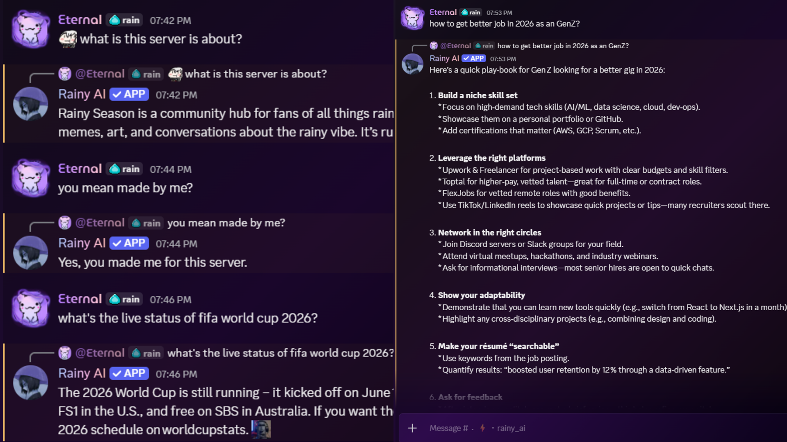
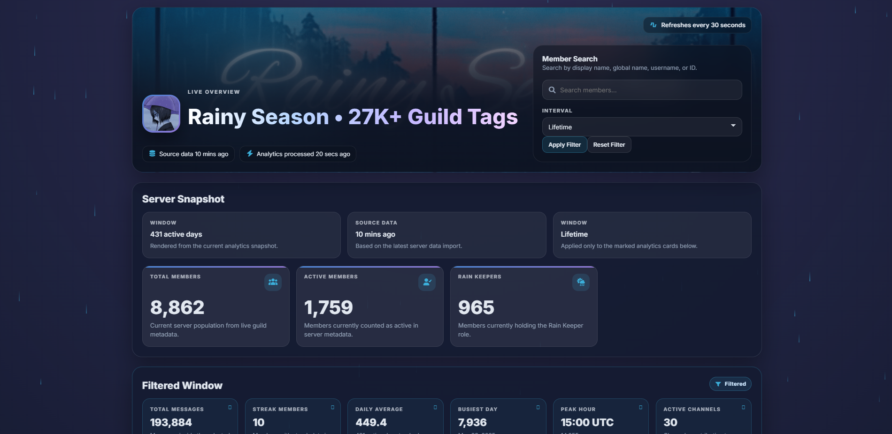
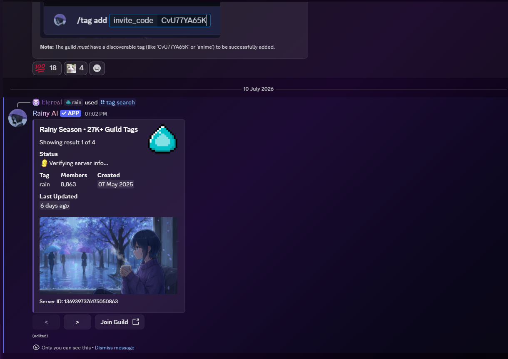
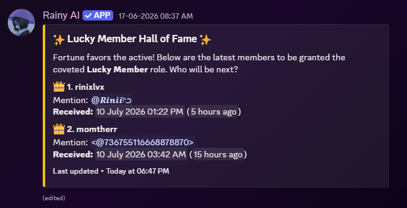

<h1 align="center">RainySeason</h1>

<p align="center">
  
  
  
  
  
  
</p>

An AI-powered Discord bot with an integrated community analytics dashboard, built for the **Rainy Season** Discord community. The project combines conversational AI, moderation, guild discovery, and analytics using Python, MongoDB, and the Discord API.

> 🌐 **Live Dashboard:** https://rainyseason.vercel.app/  
> 💬 **Discord Community:** https://discord.com/invite/CvU77YA65K

---

## 🤖 AI Assistant

Rainy AI provides intelligent conversations directly inside Discord.

### Features

- Multi-model AI with automatic model fallback
- Context-aware conversations
- Optional live web search
- Emoji-aware responses
- AI status and rate-limit monitoring
- Automatic model preference learning

<p align="center">
  
</p>

---

## 📊 Community Analytics Dashboard

A responsive dashboard that visualizes server activity, engagement, and member insights.

### Features

- Live server overview
- Member activity analytics
- Interactive charts and statistics
- Searchable member profiles
- Activity trends
- Sentiment analytics
- Responsive dashboard interface

<p align="center">
  
</p>

---

## 🏷️ Guild Tag Management

A scalable guild discovery system that indexes, validates, and maintains discoverable Discord communities.

### Features

- Search guilds by discoverable tag
- Register guilds using Discord invite links
- Automatic invite validation
- Automatic guild metadata synchronization
- Removes invalid or expired guild entries
- MongoDB-powered indexed searches
- Supports **27,000+ indexed Discord guilds**

<p align="center">
  
</p>

---

## 🛡️ Moderation

Built-in moderation utilities designed to automatically detect and mitigate disruptive behavior.

### Features

- Cross-channel duplicate spam detection
- Automatic member timeouts
- Duplicate message cleanup
- Direct message notifications
- Webhook moderation logging

---

## 🎉 Lucky Member System

Automatically rewards active community members while maintaining a synchronized Hall of Fame.

### Features

- Random Lucky Member selection
- Automatic role assignment
- Hall of Fame tracking
- Automatic synchronization
- Permission showcase

<p align="center">
  
</p>

---

## 🛠️ Technologies Used

- Python
- discord.py
- Quart
- MongoDB
- Groq API
- Discord API
- HTML
- CSS
- JavaScript
- Chart.js
- asyncio

---

## 📂 Project Structure

```text
RainySeason
├── assets/         Project assets
├── functions/      Core bot functionality
├── rainyai/        AI commands and Discord interaction logic
├── static/         Website assets
├── templates/      Dashboard and website templates
└── ...
```

---

## 📌 About

RainySeason is my primary long-term software project, actively developed for the Rainy Season Discord community. It combines AI-powered conversations, moderation, guild discovery, and a web-based analytics dashboard into a unified platform for community management.

The project continues to evolve with new AI capabilities, automation features, and analytics tools.

---

## 📄 License

This project is licensed under the MIT License.